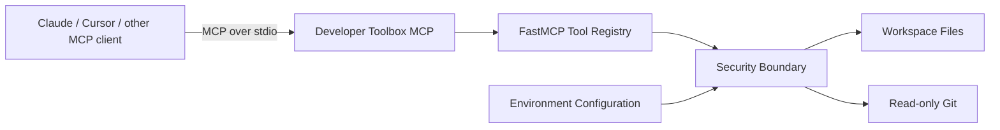

# Developer Toolbox MCP

A security-conscious **Model Context Protocol (MCP)** server written in Python that gives compatible AI clients a small set of developer tools for inspecting a local codebase.

The project is deliberately being built as a **practical software-engineering study project**. Its purpose is not only to produce a working MCP server, but to document how MCP works, why architectural decisions were made, which security boundaries are necessary when an LLM can request tool execution, and how the implementation evolves from a small local server toward a more observable and production-oriented architecture.

## Why this project exists

Reading about MCP explains the protocol; implementing an MCP server exposes the engineering problems around it: tool contracts, trust boundaries, filesystem access, subprocess execution, input validation, transport choices, testing, packaging and observability.

This repository therefore acts as both:

1. a working developer toolbox; and
2. a public engineering notebook demonstrating the practical application of MCP concepts.

The implementation is intentionally incremental. New capabilities should come with an explanation of the design decision and, where appropriate, tests and security controls.

## What is MCP?

The Model Context Protocol is an open protocol that standardizes how AI applications can connect to external tools and contextual data. An MCP server exposes capabilities through defined protocol primitives; an MCP client can discover and invoke those capabilities without each integration requiring a completely bespoke interface.

This project uses the Python MCP SDK and its `FastMCP` server API.

## Current capabilities — v0.1

| Tool | Purpose | Safety boundary |
| --- | --- | --- |
| `health_check` | Reports basic service health | Does not expose host details |
| `list_repo_files` | Lists files/directories | Confined to configured workspace |
| `read_file` | Reads UTF-8 source/text files | Size limit + credential blocking |
| `search_code` | Literal case-insensitive code search | Bounded results + workspace confinement |
| `git_status` | Reads Git working-tree status | Fixed read-only Git command |
| `git_log` | Reads compact commit history | Fixed command + bounded history |

There are deliberately **no arbitrary shell-command tools** in this release.

## Architecture



The first version uses `stdio`. Keeping the server local avoids introducing remote authentication, exposed ports and multi-user authorization before those concerns can be modeled properly.

See [`docs/architecture.md`](docs/architecture.md) for the component model, request flow, threat assumptions and roadmap.

## How it was built

The implementation was split into a few explicit responsibilities rather than putting every tool directly into one script:

- **`server.py`** defines the MCP server and the public tool contracts.
- **`security.py`** owns filesystem validation and security boundaries.
- **`config.py`** loads bounded runtime configuration from environment variables.
- **tests** exercise security-sensitive behavior independently of an AI client.
- **Docker** provides a reproducible execution path and runs as a non-root user.
- **GitHub Actions** runs linting and tests across supported Python versions.

An important design decision was to treat tool arguments as **untrusted input**. The fact that an argument comes from an LLM does not make it safe. For example, `read_file("../../.ssh/id_rsa")` must be rejected by the server itself rather than relying on the model to avoid requesting it.

For Git integration, the server does not expose a generic command executor. It builds a fixed `git` argument list and invokes it without shell interpolation. That keeps the v0.1 Git surface read-only and substantially smaller.

## Security decisions

This is a study implementation, **not a claim of production hardening**. Nevertheless, security is part of the exercise rather than an afterthought.

Current controls include:

- canonical workspace-root confinement;
- path traversal prevention;
- `.env`, private-key and certificate-file blocking;
- maximum readable file size;
- bounded search and Git-log results;
- no arbitrary shell tool;
- subprocess timeout;
- fixed read-only Git operations;
- Docker process running without root privileges;
- no database credentials or external secrets required for v0.1.

These controls also provide concrete examples of **least privilege**, **input validation**, **attack-surface reduction**, and **defense in depth**.

## Project structure

```text
developer-toolbox-mcp/
├── .github/workflows/ci.yml
├── docs/
│   └── architecture.md
├── src/developer_toolbox_mcp/
│   ├── __init__.py
│   ├── config.py
│   ├── security.py
│   └── server.py
├── tests/
│   └── test_security.py
├── .env.example
├── .gitignore
├── Dockerfile
├── LICENSE
├── pyproject.toml
└── README.md
```

## Running locally

### Requirements

- Python 3.11+
- Git

### 1. Clone

```bash
git clone https://github.com/ErikaMendes89/developer-toolbox-mcp.git
cd developer-toolbox-mcp
```

When testing the implementation before it reaches `main`, checkout the implementation branch shown in the pull request.

### 2. Create a virtual environment

Linux/macOS:

```bash
python3 -m venv .venv
source .venv/bin/activate
```

Windows PowerShell:

```powershell
py -m venv .venv
.\.venv\Scripts\Activate.ps1
```

### 3. Install

```bash
python -m pip install --upgrade pip
pip install -e '.[dev]'
```

### 4. Configure the workspace

```bash
cp .env.example .env
```

The important setting is:

```dotenv
TOOLBOX_WORKSPACE_ROOT=.
```

Only files below that directory are eligible for filesystem tools. To experiment on another repository, point this value to that repository instead of broadening it to your entire home directory.

### 5. Run tests and lint

```bash
ruff check .
pytest --cov=developer_toolbox_mcp --cov-report=term-missing
```

### 6. Start the MCP server

```bash
developer-toolbox-mcp
```

The process waits for an MCP client over standard input/output. It is normal for it not to behave like a conventional interactive CLI.

## Example MCP client configuration

After installing the project in its virtual environment, configure a compatible client to launch the server executable. Paths must be absolute and adapted to your machine.

```json
{
  "mcpServers": {
    "developer-toolbox": {
      "command": "/absolute/path/developer-toolbox-mcp/.venv/bin/developer-toolbox-mcp",
      "env": {
        "TOOLBOX_WORKSPACE_ROOT": "/absolute/path/to/repository-to-inspect"
      }
    }
  }
}
```

Client configuration formats can differ, so consult the documentation for the specific MCP client you are testing.

## Docker

Build:

```bash
docker build -t developer-toolbox-mcp .
```

The image runs as an unprivileged user and expects the inspected workspace at `/workspace`.

For a read-only experiment:

```bash
docker run --rm -i -v "$PWD:/workspace:ro" developer-toolbox-mcp
```

## What I am studying through this repository

The practical topics covered by the project include:

- MCP client/server architecture;
- tool discovery and invocation;
- Python packaging;
- typed configuration with Pydantic;
- secure filesystem boundaries;
- subprocess isolation;
- threat modeling for AI tool execution;
- automated testing;
- CI with GitHub Actions;
- container hardening;
- observability and RAG in later iterations.

## Roadmap

### v0.2 — Developer ergonomics

Richer code navigation and safe Git inspection.

### v0.3 — Data access

A PostgreSQL adapter designed around a read-only database role, query validation, timeouts and explicit allowlists.

### v0.4 — RAG

Semantic documentation search using embeddings and a vector store, with attention to retrieval quality and evaluation rather than adding RAG only as a feature label.

### v0.5 — Observability

Structured logs, metrics and distributed traces with OpenTelemetry.

### v1.0 — Remote-security study

Experiment with a network transport, authentication, authorization/policies and a more formal threat model.

## Learning philosophy

This repository favors understandable engineering decisions over unnecessary complexity. Features are added when they create a concrete learning objective or developer use case.

The aim is to be able to explain not only **what the code does**, but also **why it was designed this way, what can go wrong, what trade-offs were accepted, and what would need to change before production use**.

## License

MIT — see [`LICENSE`](LICENSE).
