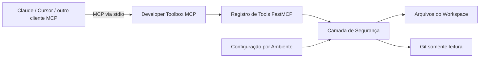

# Developer Toolbox MCP

Um servidor **Model Context Protocol (MCP)** desenvolvido em Python, com foco em segurança, que oferece a clientes de IA compatíveis um conjunto de ferramentas para inspecionar uma base de código local.

Este projeto está sendo desenvolvido deliberadamente como uma **parte prática de estudo em Engenharia de Software, IA aplicada e MCP**. O objetivo não é apenas criar um servidor MCP funcional, mas também documentar como o protocolo funciona, por que determinadas decisões arquiteturais foram tomadas, quais limites de segurança são necessários quando um LLM pode solicitar a execução de ferramentas e como a implementação pode evoluir de um servidor local pequeno para uma arquitetura mais observável e próxima de um cenário de produção.

## Por que este projeto existe?

Ler sobre MCP ajuda a entender o protocolo. Implementar um servidor MCP, porém, expõe problemas reais de engenharia: contratos de ferramentas, fronteiras de confiança, acesso ao sistema de arquivos, execução de subprocessos, validação de entrada, escolha de transporte, testes, empacotamento e observabilidade.

Por isso, este repositório funciona ao mesmo tempo como:

1. uma toolbox funcional para desenvolvimento; e
2. um registro público de estudo de engenharia, mostrando a aplicação prática dos conceitos de MCP.

A implementação é propositalmente incremental. Novas funcionalidades devem vir acompanhadas da justificativa da decisão de projeto e, quando aplicável, de testes e controles de segurança.

## O que é MCP?

O **Model Context Protocol** é um protocolo aberto que padroniza a forma como aplicações de IA se conectam a ferramentas externas e fontes de contexto. Um servidor MCP expõe capacidades por meio de primitivas definidas pelo protocolo; um cliente MCP pode descobrir e invocar essas capacidades sem que cada integração precise implementar uma interface totalmente proprietária.

Este projeto utiliza o SDK MCP para Python e a API de servidor `FastMCP`.

## Funcionalidades atuais — v0.1

| Tool | Finalidade | Limite de segurança |
| --- | --- | --- |
| `health_check` | Informa o estado básico do serviço | Não expõe detalhes desnecessários do host |
| `list_repo_files` | Lista arquivos e diretórios | Restrito ao workspace configurado |
| `read_file` | Lê arquivos de texto/código em UTF-8 | Limite de tamanho + bloqueio de credenciais |
| `search_code` | Busca literal case-insensitive no código | Quantidade de resultados limitada + confinamento ao workspace |
| `git_status` | Consulta o estado da working tree do Git | Comando Git fixo e somente leitura |
| `git_log` | Consulta um histórico compacto de commits | Comando fixo + histórico limitado |

Nesta versão, deliberadamente **não existe uma ferramenta para executar comandos arbitrários de shell**.

## Arquitetura



A primeira versão utiliza `stdio`. Manter o servidor local evita introduzir precocemente autenticação remota, portas expostas e autorização multiusuário antes que essas preocupações sejam modeladas corretamente.

Veja [`docs/architecture.md`](docs/architecture.md) para o modelo de componentes, fluxo das requisições, premissas de segurança e roadmap.

## Como o projeto foi construído

A implementação foi separada em responsabilidades explícitas, em vez de concentrar todas as ferramentas em um único script:

- **`server.py`** define o servidor MCP e os contratos públicos das tools.
- **`security.py`** concentra validações de filesystem e limites de segurança.
- **`config.py`** carrega configurações de execução por variáveis de ambiente usando limites definidos.
- **testes** validam comportamentos sensíveis à segurança sem depender de um cliente de IA.
- **Docker** fornece uma forma reproduzível de execução e utiliza usuário não-root.
- **GitHub Actions** executa lint e testes nas versões de Python suportadas.

Uma decisão importante foi tratar os argumentos recebidos pelas tools como **entrada não confiável**. O fato de um argumento ter sido produzido por um LLM não o torna seguro. Por exemplo, `read_file("../../.ssh/id_rsa")` deve ser bloqueado pelo próprio servidor, sem depender do modelo para evitar esse tipo de solicitação.

Na integração com Git, o servidor não disponibiliza um executor genérico de comandos. Ele monta uma lista fixa de argumentos do `git` e executa o processo sem interpolação via shell. Dessa forma, a superfície de ataque da v0.1 permanece menor e as operações Git continuam somente leitura.

## Decisões de segurança

Este é um projeto de estudo e **não deve ser interpretado como um sistema já endurecido para produção**. Mesmo assim, segurança faz parte do exercício desde o início e não é tratada como detalhe posterior.

Controles atuais:

- confinamento ao diretório raiz do workspace;
- prevenção de path traversal;
- bloqueio de `.env`, chaves privadas e arquivos de certificado;
- limite máximo para leitura de arquivos;
- limites para resultados de busca e histórico Git;
- ausência de execução arbitrária de shell;
- timeout para subprocessos;
- operações Git fixas e somente leitura;
- processo Docker executado sem privilégios de root;
- nenhuma credencial de banco ou segredo externo necessário na v0.1.

Essas decisões servem como exemplos práticos de **princípio do menor privilégio**, **validação de entrada**, **redução da superfície de ataque** e **defesa em profundidade**.

## Estrutura do projeto

```text
developer-toolbox-mcp/
├── .github/workflows/ci.yml
├── docs/
│   └── architecture.md
├── src/developer_toolbox_mcp/
│   ├── __init__.py
│   ├── config.py
│   ├── security.py
│   └── server.py
├── tests/
│   └── test_security.py
├── .env.example
├── .gitignore
├── Dockerfile
├── LICENSE
├── pyproject.toml
└── README.md
```

## Executando localmente

### Requisitos

- Python 3.11+
- Git

### 1. Clonar o repositório

```bash
git clone https://github.com/ErikaMendes89/developer-toolbox-mcp.git
cd developer-toolbox-mcp
```

Enquanto a implementação ainda não estiver na `main`, faça checkout da branch apresentada no Pull Request.

### 2. Criar um ambiente virtual

Linux/macOS:

```bash
python3 -m venv .venv
source .venv/bin/activate
```

Windows PowerShell:

```powershell
py -m venv .venv
.\.venv\Scripts\Activate.ps1
```

### 3. Instalar as dependências

```bash
python -m pip install --upgrade pip
pip install -e '.[dev]'
```

### 4. Configurar o workspace

```bash
cp .env.example .env
```

A configuração principal é:

```dotenv
TOOLBOX_WORKSPACE_ROOT=.
```

Somente arquivos abaixo desse diretório podem ser acessados pelas tools de filesystem. Para experimentar em outro repositório, aponte essa variável especificamente para ele em vez de liberar todo o seu diretório pessoal.

### 5. Executar testes e lint

```bash
ruff check .
pytest --cov=developer_toolbox_mcp --cov-report=term-missing
```

### 6. Iniciar o servidor MCP

```bash
developer-toolbox-mcp
```

O processo ficará aguardando a comunicação de um cliente MCP por entrada/saída padrão. Portanto, é normal que ele não se comporte como uma CLI interativa convencional.

## Exemplo de configuração de um cliente MCP

Depois de instalar o projeto no ambiente virtual, configure um cliente compatível para iniciar o executável do servidor. Os caminhos devem ser absolutos e adaptados à sua máquina.

```json
{
  "mcpServers": {
    "developer-toolbox": {
      "command": "/caminho/absoluto/developer-toolbox-mcp/.venv/bin/developer-toolbox-mcp",
      "env": {
        "TOOLBOX_WORKSPACE_ROOT": "/caminho/absoluto/do/repositorio-a-inspecionar"
      }
    }
  }
}
```

O formato de configuração pode variar entre clientes MCP. Consulte a documentação do cliente específico usado nos testes.

## Docker

Build da imagem:

```bash
docker build -t developer-toolbox-mcp .
```

A imagem executa com um usuário sem privilégios e espera que o workspace analisado esteja montado em `/workspace`.

Exemplo de execução com volume somente leitura:

```bash
docker run --rm -i -v "$PWD:/workspace:ro" developer-toolbox-mcp
```

## O que estou estudando com este repositório

Os principais tópicos práticos abordados são:

- arquitetura cliente/servidor do MCP;
- descoberta e invocação de tools;
- empacotamento de aplicações Python;
- configuração tipada com Pydantic;
- fronteiras seguras de acesso ao filesystem;
- isolamento de subprocessos;
- threat modeling aplicado à execução de ferramentas por IA;
- testes automatizados;
- CI com GitHub Actions;
- hardening de containers;
- observabilidade e RAG nas próximas versões.

## Roadmap

### v0.2 — Experiência de desenvolvimento

Navegação de código mais rica e inspeção segura do Git.

### v0.3 — Acesso a dados

Adapter PostgreSQL utilizando usuário de banco somente leitura, validação de queries, timeouts e allowlists explícitas.

### v0.4 — RAG

Busca semântica em documentação utilizando embeddings e banco vetorial, incluindo preocupação com qualidade de recuperação e avaliação — não apenas adicionando RAG como um rótulo de feature.

### v0.5 — Observabilidade

Logs estruturados, métricas e traces distribuídos com OpenTelemetry.

### v1.0 — Estudo de segurança para execução remota

Experimentos com transporte em rede, autenticação, autorização/policies e um modelo de ameaças mais formal.

## Filosofia de aprendizado

Este repositório prioriza decisões de engenharia compreensíveis em vez de complexidade desnecessária. Funcionalidades são adicionadas quando criam um objetivo concreto de aprendizado ou um caso de uso real para desenvolvimento.

O objetivo é conseguir explicar não apenas **o que o código faz**, mas também **por que ele foi projetado dessa forma, o que pode dar errado, quais trade-offs foram aceitos e o que precisaria mudar antes de um uso em produção**.

## Licença

MIT — consulte [`LICENSE`](LICENSE).
