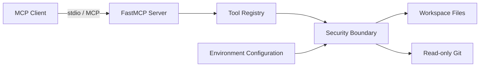

# Architecture

## Purpose

Developer Toolbox MCP is intentionally small in its first release. The goal is to learn MCP by implementing a real server while keeping the security boundary understandable enough to audit.

## Component view

## Request flow

1. An MCP client discovers a tool exposed by the server.
2. FastMCP validates and dispatches the tool call.
3. Filesystem inputs are resolved against one configured workspace root.
4. Security checks reject traversal, credential-like files, oversized files, and unsupported binary content.
5. Git tools execute a fixed command and argument list with `shell=False` semantics through `subprocess.run`.
6. A bounded result is returned to the MCP client.

## Security model

The initial version assumes the MCP client itself may send untrusted arguments. Therefore trust is not delegated to the model.

Controls implemented in v0.1:

- workspace root confinement;
- path traversal prevention using resolved paths;
- secret/credential filename blocking;
- maximum file size;
- bounded search results;
- bounded Git history;
- fixed read-only Git operations;
- subprocess execution without a shell;
- subprocess timeout;
- Docker execution as an unprivileged user;
- no database or network credentials required.

This is defense in depth, not a claim that the project is production-hardened.

## Why stdio first?

stdio keeps the first implementation local and avoids prematurely introducing HTTP authentication, exposed ports, TLS, CORS, and remote multi-user authorization. A network transport can be studied later with an explicit threat model.

## Planned evolution

- v0.2: richer Git and code-navigation tools;
- v0.3: PostgreSQL read-only adapter with explicit allowlists;
- v0.4: semantic documentation search / RAG;
- v0.5: structured logs, metrics, traces and OpenTelemetry;
- v1.0: authentication/policy layer for remote deployment experiments.
