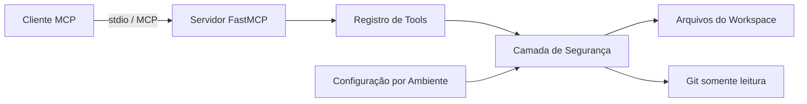

# Arquitetura

## Objetivo

O Developer Toolbox MCP é intencionalmente pequeno em sua primeira versão. O objetivo é estudar MCP por meio da implementação de um servidor real, mantendo a fronteira de segurança simples o suficiente para ser compreendida, revisada e auditada.

## Visão de componentes

## Fluxo de uma requisição

1. Um cliente MCP descobre uma tool exposta pelo servidor.
2. O FastMCP valida e encaminha a chamada da tool.
3. Entradas relacionadas ao filesystem são resolvidas a partir de uma única raiz de workspace configurada.
4. As validações de segurança bloqueiam path traversal, arquivos com aparência de credenciais, arquivos grandes demais e conteúdo binário não suportado.
5. As tools de Git executam comandos e argumentos fixos com semântica `shell=False` por meio de `subprocess.run`.
6. Um resultado limitado é devolvido ao cliente MCP.

## Modelo de segurança

A versão inicial assume que o próprio cliente MCP pode enviar argumentos não confiáveis. Portanto, a confiança não é delegada ao modelo de IA.

Controles implementados na v0.1:

- confinamento ao diretório raiz do workspace;
- prevenção de path traversal utilizando caminhos resolvidos;
- bloqueio de nomes de arquivos associados a segredos ou credenciais;
- limite máximo de tamanho de arquivo;
- quantidade limitada de resultados de busca;
- histórico Git limitado;
- operações Git fixas e somente leitura;
- execução de subprocessos sem shell;
- timeout de subprocessos;
- execução do container Docker com usuário sem privilégios;
- nenhuma credencial de banco de dados ou rede exigida.

Essa estratégia aplica defesa em profundidade, mas não representa uma afirmação de que o projeto já esteja endurecido para produção.

## Por que começar com stdio?

O uso de `stdio` mantém a primeira implementação local e evita introduzir cedo demais autenticação HTTP, portas expostas, TLS, CORS e autorização remota multiusuário. Um transporte em rede poderá ser estudado posteriormente, acompanhado de um modelo de ameaças explícito.

## Evolução planejada

- **v0.2:** ferramentas mais completas de Git e navegação de código;
- **v0.3:** adapter PostgreSQL somente leitura com allowlists explícitas;
- **v0.4:** busca semântica em documentação / RAG;
- **v0.5:** logs estruturados, métricas, traces e OpenTelemetry;
- **v1.0:** camada de autenticação e policies para experimentos de execução remota.
